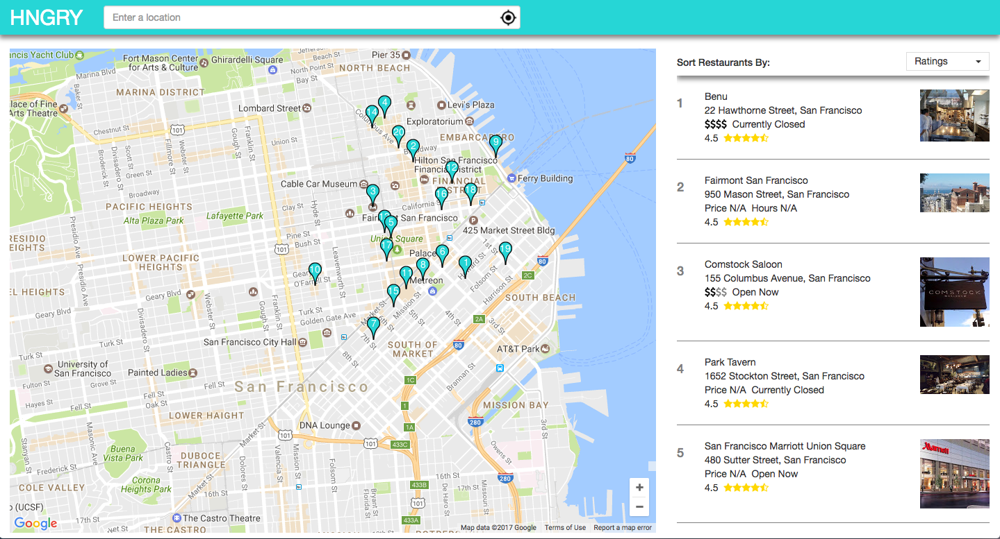

# HNGRY

HNGRY is a web application to find and plot nearby restaurants on a map.

## Installation
- Clone down the repo
- Install NPM dependencies in terminal: `npm install`
- Run: `npm run build`
- Run: `npm start`
- Navigate to localhost:3000

## Usage

- Enter an address or location in the search bar and select an autocomplete option to search.
- Press on the geolocation button located in the search bar to locate yourself and search nearby.
- Select rating or price filter via the dropdown to reload the map and list with the selected filter.
- Zoom and pan the map to redo search in new location.
- Show info window of specific restaurant by hovering over marker.

## License

This project is licensed under the MIT License
